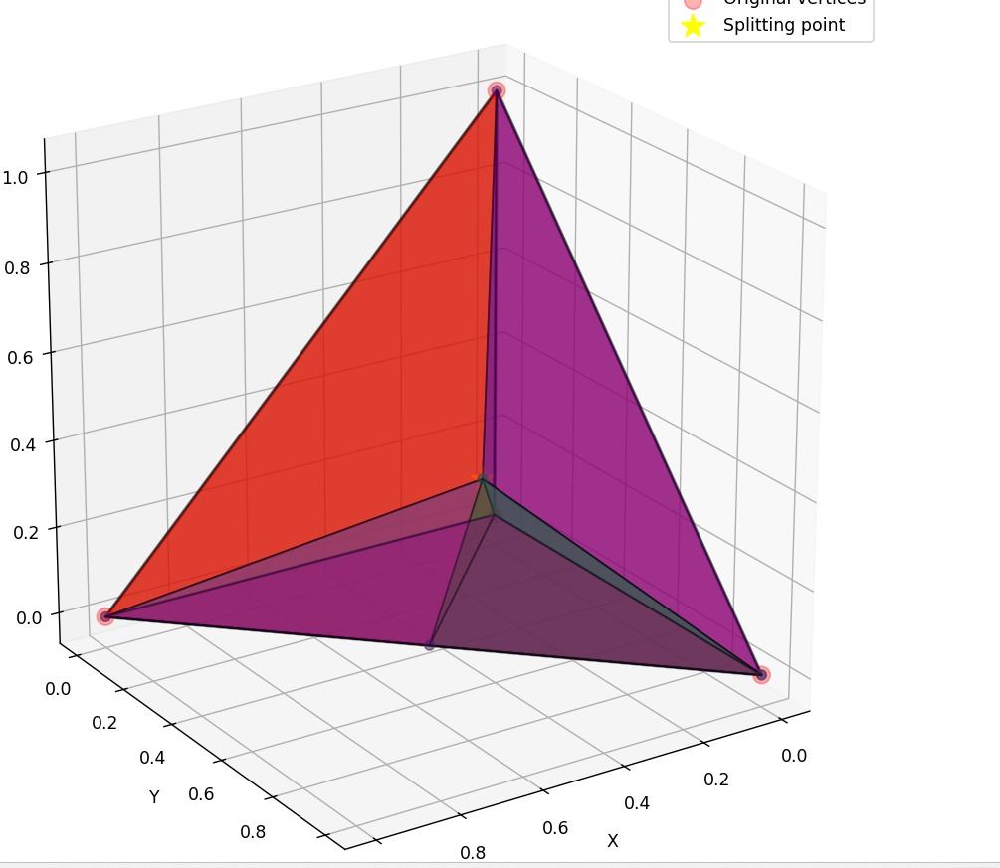
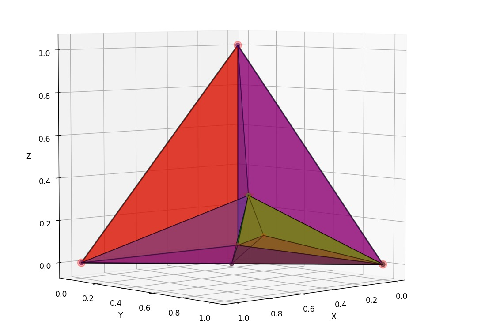

# Image Display Test

This file tests if GitHub can properly display the images in your repository.

## 🖼️ Test Images

### 1. Original Tetrahedron

### 2. First Child Subdivision

### 3. Multiple Children Subdivision

## 📊 Test Mermaid Diagram

## ✅ Test Results

If you can see:
- [x] The three tetrahedron images above
- [x] The mermaid diagram rendered as a visual graph
- [x] Proper image titles on hover

Then GitHub visualization is working perfectly!

## 🚀 Next Steps

1. **Commit and push** these changes to GitHub
2. **View on GitHub.com** to see the rendered images
3. **Add more images** as needed for your documentation

The images should now display correctly on GitHub! 