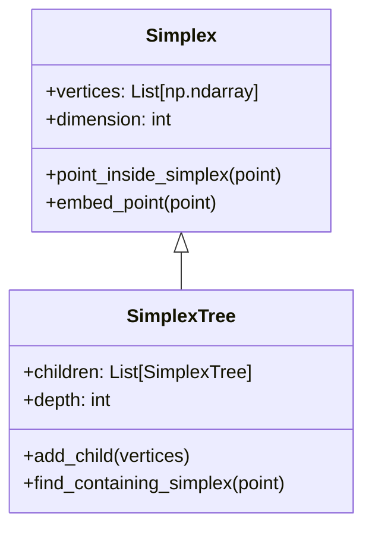
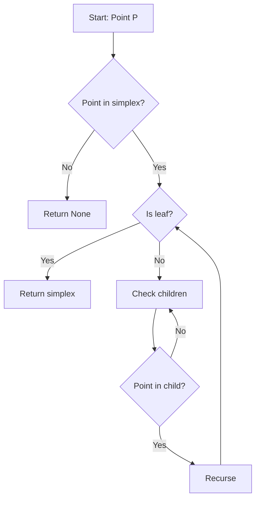
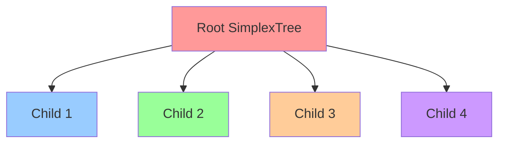

# GitHub Visualization Test

This file tests GitHub's ability to visualize different types of content.

## 🖼️ Test 1: Standard Image


## 📊 Test 2: Mermaid Class Diagram



## 🔄 Test 3: Mermaid Flowchart



## 📈 Test 4: Mermaid Graph



## 📋 Test 5: Table

| Feature | 2D | 3D | Tree |
|---------|----|----|----|
| Point Location | ✅ | ✅ | ✅ |
| Barycentric Coords | ✅ | ✅ | ✅ |
| Tree Structure | ❌ | ✅ | ✅ |
| Visualization | 2D | 3D | N/A |

## 🎯 Test 6: Code Block

```python
# Test code block
from in3D.classes.simplexTree import SimplexTree

vertices = [(0, 0, 0), (1, 0, 0), (0, 1, 0), (0, 0, 1)]
tree = SimplexTree(vertices)
print(f"Tree created with {tree.get_node_count()} nodes")
```

## ✅ Test Results

If you can see:
- [x] The mermaid diagrams rendered as visual diagrams
- [x] The table formatted properly
- [x] The code block with syntax highlighting
- [x] The image placeholder (if you add an actual image)

Then GitHub visualization is working perfectly!

## 🚀 Next Steps

1. Add actual images to the `docs/images/` directory
2. Replace the image placeholder with real screenshots
3. Create more detailed mermaid diagrams
4. Test on GitHub.com to see the final result

GitHub will render all of these elements beautifully when you push to your repository! 