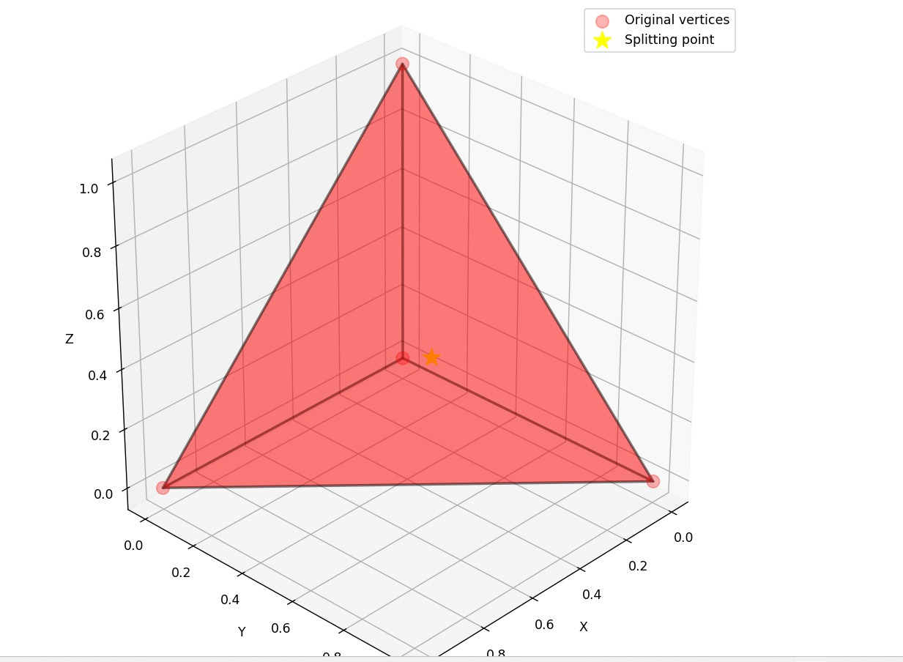

# Tree Structure Visualization

## Example: 3D Tetrahedron with Splitting Point Subdivision

### Initial Setup
```
Root Tetrahedron: [(0,0,0), (1,0,0), (0,1,0), (0,0,1)]
Dimension: 3
Splitting Point: (0.3, 0.4, 0.3)
Branching Factor: 4 (equal to dimension + 1)
```

### Tree Structure After Subdivision

```
                    Root SimplexTree
                    [(0,0,0), (1,0,0), (0,1,0), (0,0,1)]
                    (is_simplex_tree() = True)
                           │
                    ┌──────┼──────┐
                    │      │      │
              Child 1  Child 2  Child 3  Child 4
        [(0.3,0.4,0.3), (1,0,0), (0,1,0), (0,0,1)]  [(0,0,0), (0.3,0.4,0.3), (0,1,0), (0,0,1)]  [(0,0,0), (1,0,0), (0.3,0.4,0.3), (0,0,1)]  [(0,0,0), (1,0,0), (0,1,0), (0.3,0.4,0.3)]
        (is_simplex() = True)       (is_simplex() = True)       (is_simplex() = True)       (is_simplex() = True)
```

## Subdivision Method: Vertex Replacement

The `add_splitting_point()` method creates children by replacing each vertex with the splitting point:


### Child 0: The Tehederon
- **Original**: [(0,0,0), (1,0,0), (0,1,0), (0,0,1)]



### Child 1: Replace V₀ with splitting point
- **Original**: [(0,0,0), (1,0,0), (0,1,0), (0,0,1)]
- **Child 1**: [(0.3,0.4,0.3), (1,0,0), (0,1,0), (0,0,1)]


### Child 2: Replace V₁ with splitting point
- **Original**: [(0,0,0), (1,0,0), (0,1,0), (0,0,1)]
- **Child 2**: [(0,0,0), (0.3,0.4,0.3), (0,1,0), (0,0,1)]


### Child 3: Replace V₂ with splitting point
- **Original**: [(0,0,0), (1,0,0), (0,1,0), (0,0,1)]
- **Child 3**: [(0,0,0), (1,0,0), (0.3,0.4,0.3), (0,0,1)]

### Child 4: Replace V₃ with splitting point
- **Original**: [(0,0,0), (1,0,0), (0,1,0), (0,0,1)]
- **Child 4**: [(0,0,0), (1,0,0), (0,1,0), (0.3,0.4,0.3)]


## Parent-Child List Structure

```
ParentChildSimplexTreeNode
├── simplex_tree: SimplexTree([(0,0,0), (1,0,0), (0,1,0), (0,0,1)])
├── children: [
│   ├── ParentChildSimplexTreeNode
│   │   └── simplex_tree: SimplexTree([(0.3,0.4,0.3), (1,0,0), (0,1,0), (0,0,1)])
│   ├── ParentChildSimplexTreeNode
│   │   └── simplex_tree: SimplexTree([(0,0,0), (0.3,0.4,0.3), (0,1,0), (0,0,1)])
│   ├── ParentChildSimplexTreeNode
│   │   └── simplex_tree: SimplexTree([(0,0,0), (1,0,0), (0.3,0.4,0.3), (0,0,1)])
│   └── ParentChildSimplexTreeNode
│       └── simplex_tree: SimplexTree([(0,0,0), (1,0,0), (0,1,0), (0.3,0.4,0.3)])
```

## Left Child-Right Sibling Structure

```
LeftChildRightSiblingSimplexTreeNode
├── simplex_tree: SimplexTree([(0,0,0), (1,0,0), (0,1,0), (0,0,1)])
├── left_child: LeftChildRightSiblingSimplexTreeNode
│   ├── simplex_tree: SimplexTree([(0.3,0.4,0.3), (1,0,0), (0,1,0), (0,0,1)])
│   ├── left_child: None
│   └── right_sibling: LeftChildRightSiblingSimplexTreeNode
│       ├── simplex_tree: SimplexTree([(0,0,0), (0.3,0.4,0.3), (0,1,0), (0,0,1)])
│       ├── left_child: None
│       └── right_sibling: LeftChildRightSiblingSimplexTreeNode
│           ├── simplex_tree: SimplexTree([(0,0,0), (1,0,0), (0.3,0.4,0.3), (0,0,1)])
│           ├── left_child: None
│           └── right_sibling: LeftChildRightSiblingSimplexTreeNode
│               ├── simplex_tree: SimplexTree([(0,0,0), (1,0,0), (0,1,0), (0.3,0.4,0.3)])
│               ├── left_child: None
│               └── right_sibling: None
└── right_sibling: None
```

## Point Location Algorithm Flow

### Example: Finding point (0.2, 0.3, 0.2)

```
1. Start at Root Node
   ├── point_inside_node((0.2, 0.3, 0.2)) → True
   ├── is_simplex_tree() → True (has children)
   └── Check children recursively

2. Check Child 1 [(0.3,0.4,0.3), (1,0,0), (0,1,0), (0,0,1)]
   ├── point_inside_node((0.2, 0.3, 0.2)) → False
   └── Skip this branch

3. Check Child 2 [(0,0,0), (0.3,0.4,0.3), (0,1,0), (0,0,1)]
   ├── point_inside_node((0.2, 0.3, 0.2)) → True
   ├── is_simplex() → True (no children)
   └── Return this SimplexTree

Result: Found containing simplex [(0,0,0), (0.3,0.4,0.3), (0,1,0), (0,0,1)]
```

## 2D Triangle Example

### Initial Setup
```
Root Triangle: [(0,0), (4,0), (2,3)]
Dimension: 2
Splitting Point: (1.5, 1.0)
Branching Factor: 3 (equal to dimension + 1)
```

### Tree Structure After Subdivision

```
                    Root SimplexTree
                    [(0,0), (4,0), (2,3)]
                    (is_simplex_tree() = True)
                           │
                    ┌──────┼──────┐
                    │      │      │
              Child 1  Child 2  Child 3
        [(1.5,1.0), (4,0), (2,3)]  [(0,0), (1.5,1.0), (2,3)]  [(0,0), (4,0), (1.5,1.0)]
        (is_simplex() = True)       (is_simplex() = True)       (is_simplex() = True)
```

## API Usage Examples

### Creating a Tree with Subdivision
```python
# Create root vertices (3D tetrahedron)
root_vertices = [(0, 0, 0), (1, 0, 0), (0, 1, 0), (0, 0, 1)]

# Create SimplexTree
tree_3d = SimplexTree(root_vertices)

# Add splitting point to create hierarchy
splitting_point = (0.3, 0.4, 0.3)
children = tree_3d.add_point_to_the_most_specific_simplex(splitting_point)

# Wrap in tree node for advanced operations
root_node = ParentChildSimplexTreeNode(tree_3d)
```

### Checking Node Types
```python
# Check if node is a SimplexTree (has children)
if node.is_simplex_tree():
    print("This node contains a SimplexTree with children")
    # Traverse children recursively
    for child in node.get_children():
        result = child.find_containing_simplex(point)
        if result:
            return result

# Check if node is a Simplex (no children)
if node.is_simplex():
    print("This node contains a Simplex (leaf node)")
    # Use point_inside_simplex directly
    if node.point_inside_node(point):
        return node.simplex_tree
```

### Point Location
```python
# Find containing simplex
point = (0.2, 0.3, 0.2)
containing_simplex = root_node.find_containing_simplex(point)

if containing_simplex:
    print(f"Point {point} is in simplex with vertices: {containing_simplex.vertices}")
    # Get barycentric coordinates
    coords = containing_simplex.embed_point(point)
    print(f"Barycentric coordinates: {coords}")
else:
    print(f"Point {point} is not in any simplex")
```

### Tree Traversal
```python
# Get all leaves (simplexes without children)
leaves = tree_3d.get_leaves()
print(f"Number of leaf simplexes: {len(leaves)}")

# Get nodes at specific depth
depth_1_nodes = tree_3d.get_nodes_at_depth(1)
print(f"Number of nodes at depth 1: {len(depth_1_nodes)}")

# Breadth-first traversal
for node in tree_3d.traverse_breadth_first():
    print(f"Node at depth {node.depth}: {node.vertices}")
```

## Visualization Features

### 3D Interactive Visualization
```python
from in3D.utilss.visualization import visualize_simplex_tree

# Visualize tree with splitting point
visualize_simplex_tree(tree_3d, splitting_point, "3D Tetrahedron Subdivision")
```

**Visualization Features:**
- **Color-coded hierarchy**: Different colors for each depth level
- **Transparent overlapping**: Alpha blending for overlapping simplexes
- **Splitting point highlighting**: Yellow star marker for splitting points
- **Interactive 3D**: Rotation, zoom, and pan capabilities
- **Vertex markers**: Clear visualization of simplex vertices

### Color Scheme
- **Red**: Root simplex
- **Blue/Green/Orange/Purple**: First level children
- **Lighter shades**: Deeper levels
- **Yellow star**: Splitting points

## Memory Efficiency Comparison

### Parent-Child List
- **Pros**: Easy to access all children, intuitive structure
- **Cons**: Each node stores a list of children (more memory)
- **Use Case**: When you need frequent access to all children

### Left Child-Right Sibling
- **Pros**: More memory efficient, good for binary-like operations
- **Cons**: More complex traversal, need to follow sibling chain
- **Use Case**: When memory is a concern or you need binary-like operations

## Subdivision Properties

### Branching Factor
The branching factor is always equal to the dimension + 1:
- **2D Triangle**: Branching factor = 3 (3 vertices)
- **3D Tetrahedron**: Branching factor = 4 (4 vertices)
- **nD Simplex**: Branching factor = n + 1 (n + 1 vertices)

### Geometric Properties
- **Volume preservation**: Each child simplex shares the splitting point
- **Hierarchical refinement**: Deeper levels provide finer spatial resolution
- **Overlapping regions**: Children may overlap, providing redundancy
- **Adaptive subdivision**: Points are added to the most specific containing simplex

### Performance Characteristics
- **Point location**: O(log n) average case for balanced trees
- **Memory usage**: O(n) where n is number of simplexes
- **Subdivision cost**: O(d) where d is dimension
- **Traversal efficiency**: Depends on tree structure and node type 